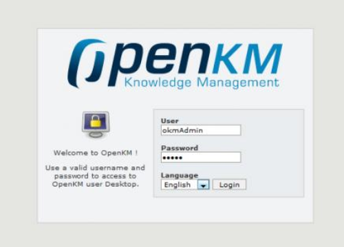
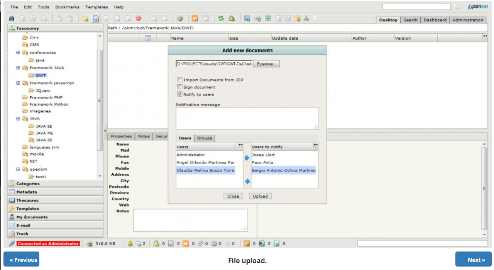
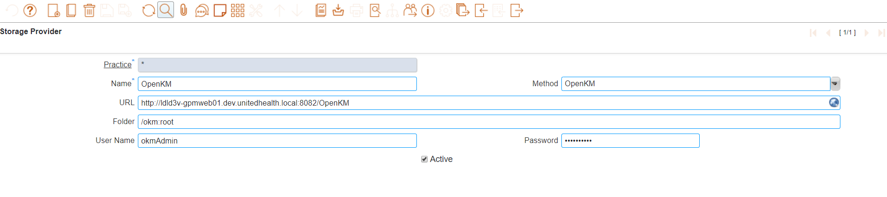

<h4 align="center">
		IDempiere attachment provider plugin for OpenKM
     
     

</h4>

 

### How to Install

## Pre-requisiites :
- iDempiere 7.1
- OpenKM

## Installation Steps :

- Install OpenKM (Version 6.3.0)
- Check whether its accessible on localhost:8082/OpenKM
- Import DMS plugin project in Eclipse
- Select DMS plugin in server.product
- Import Storage Provider 2Pack in client
- restart the server

## Sample Screen Shots

### Grid View

### Toolbar

### Attachment Popup
